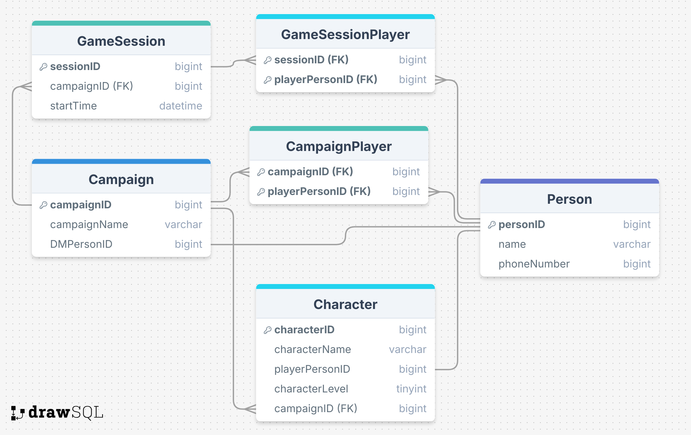
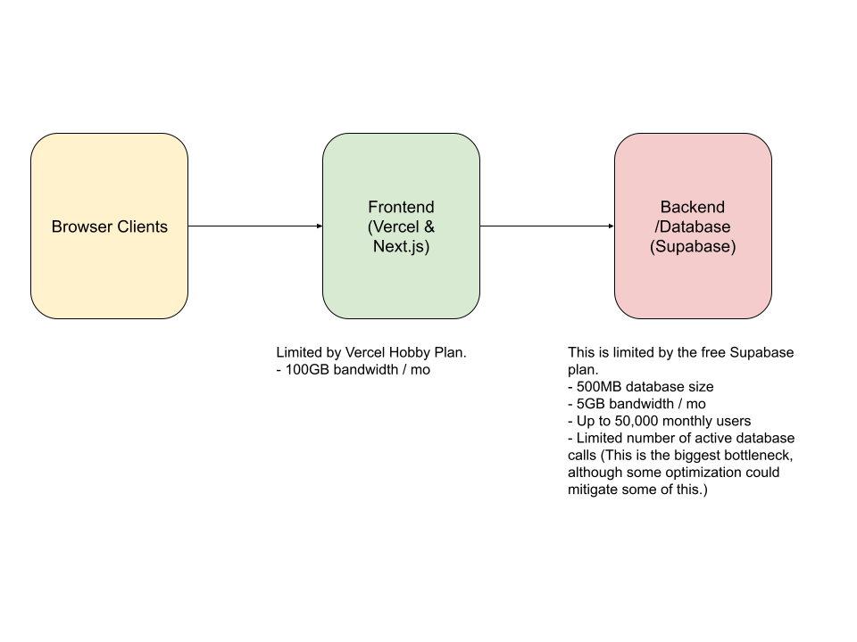

# D&D Scheduler

## Purpose

Scheduling sessions and keeping track of information for campaigns and oneshots is the bane of players and DMs alike. The purpose of this project is to create a prototype server and client for a scheduling application specifically tailored for D&D campaigns and one-shots. Users will be able to create campaigns and one-shots, as well as characters with basic info such as name, level, and class/classes. Users will be able to join campaigns and one-shots and add their characters to it, while the DM/creator of the campaign will be able to schedule sessions that all players in the campaign are able to see.

## Design

## Link to website
https://dnd-scheduler-nextjs-with-supabase.vercel.app

## Goals
(Note: These were my initial goals, but when I decided to switch to a vercel/supabase project I forgot to go back and change them!)

By 6/4:
- [x] Initial project design
- [x] Post in class channel
- [x] Initial ERD
- [x] Initial System Design

By 6/7:
- [x] Initial layout/structure for the project
- [x] Basic client terminal
- [x] Object models for
  - [x] User
  - [x] Character
  - [x] Campaign/Oneshot
  - [x] Session

By 6/11
- [ ] Basic server
- [ ] Create MySQL database
- [ ] Start websocket/http connection for client and server communication

By 6/14:
- [ ] Fully functioning server
- [ ] Fully functioning client
- [ ] Fully functioning database
- [ ] Websocket/http connection working
